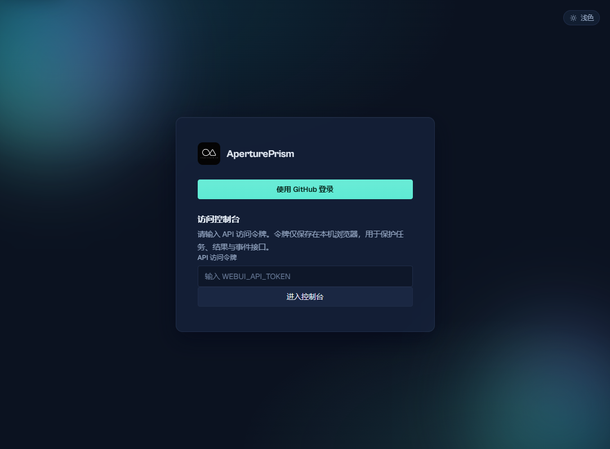
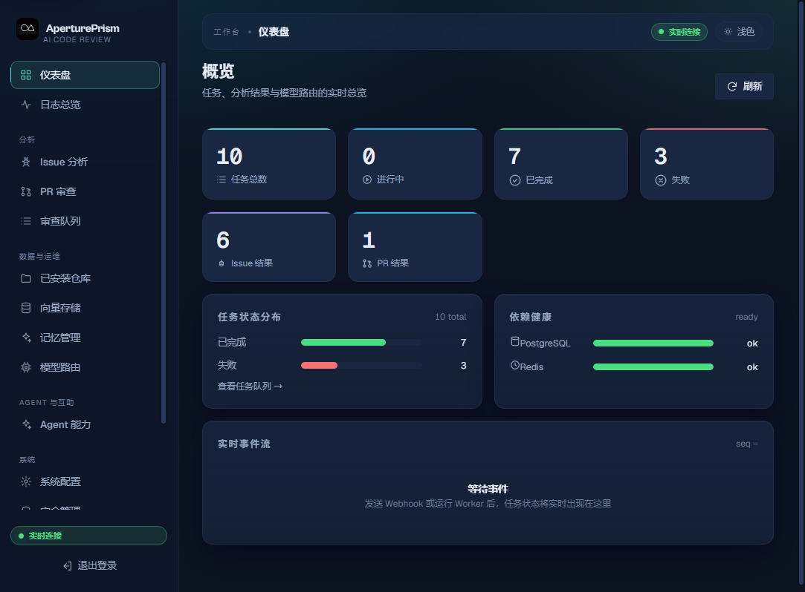
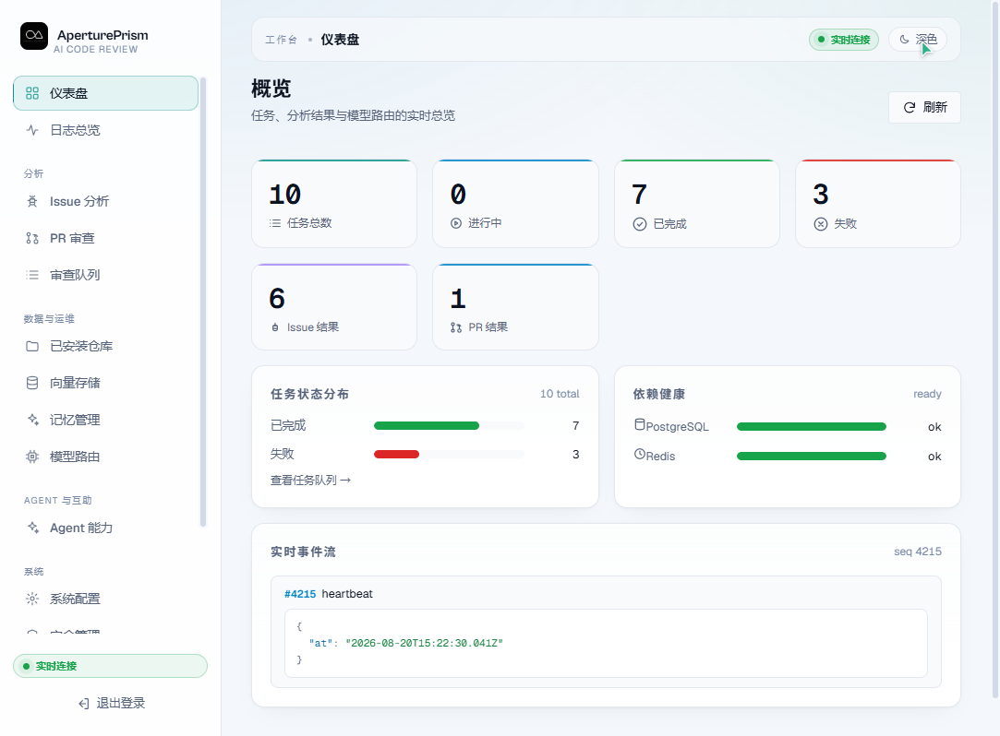
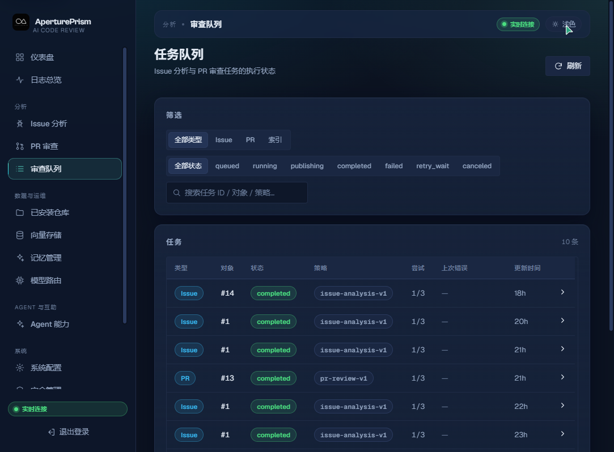
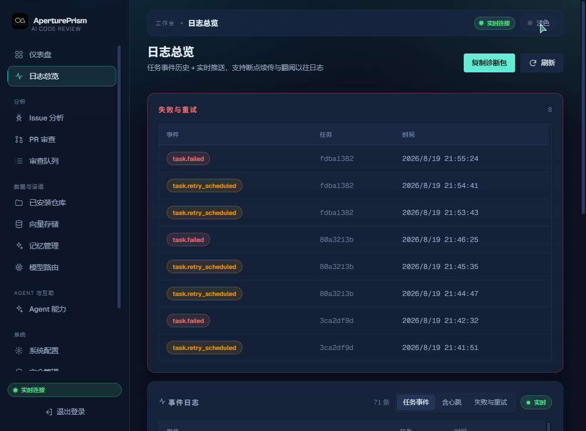

# AperturePrism-AI-Review

独立开发的 **GitHub Issue 分析与 Pull Request 审查平台**：接入 GitHub 事件（Webhook/OAuth），由任务引擎 + 多模型路由器驱动分析 Worker，对 Issue 做结构化分级分析、对 PR 做多专家审查并发布评论/Review；附带 Web 控制台（深色玻璃 UI）、QQ 机器人渠道、重复检测（全文+信号+向量 RAG）、仓库记忆、Agent Skills / 专家团队与完整运维能力（审计、备份、速率限制、Docker 一键部署）。

仓库：[BB0813/AperturePrism-AI-Review](https://github.com/BB0813/AperturePrism-AI-Review)

---

## 目录

- [项目简介](#项目简介)
- [界面预览](#界面预览)
- [核心特性](#核心特性)
- [系统架构](#系统架构)
- [文档索引](#文档索引)
- [快速开始](#快速开始)
- [Docker 部署](#docker-部署)
- [配置参考](#配置参考)
- [WebUI 功能对齐](#webui-功能对齐)
- [API 端点速查](#api-端点速查)
- [开发阶段](#开发阶段)
- [目录结构](#目录结构)
- [说明与边界](#说明与边界)
- [Todo](#todo)

---

## 项目简介

AperturePrism 把「AI 代码审查」做成了一条可落地的产品链路，而不是单个模型调用：

1. **入口**：GitHub Webhook（验签 + 幂等入库）、WebUI 手动触发、QQ 机器人指令。
2. **调度**：持久化任务引擎（状态机 / 租约 / 重试 / 幂等），Scheduler 负责租约回收与到期重试。
3. **分析**：多模型路由器在统一 deadline 下按候选策略调用（主调用 + 受限 repair），Issue 输出结构化分级（category/severity/priority/quality），PR 输出行级 finding。
4. **增强**：重复 Issue 检测（标题/正文全文 + 信号 + pgvector 向量召回 → 模型裁决）、仓库记忆（反思沉淀 → 合并 Agent → 上下文回灌）、Agent Skills + 多专家并行审查。
5. **发布**：幂等发布 GitHub 评论 / Review（head SHA 绑定），支持标签规则自动打标。
6. **运营**：深色 Web 控制台（SSE 实时事件 + 断线回放）、GitHub OAuth 登录与管理员角色、操作审计、配置备份、速率限制、向量索引管理、Docker 全栈打包。

参考项目 Sakura-AI 仅作为本地只读参考资料（`archive/` 目录不随仓库提交），本项目为独立实现。

## 界面预览

真实运行截图（浅色 / 深色双主题，Web 控制台通过 nginx 与 API 同源）：

| 登录页（深色） | 概览仪表盘（深色） |
| --- | --- |
|  |  |

| 概览仪表盘（浅色） | 任务队列 | 日志总览 |
| --- | --- | --- |
|  |  |  |

- 登录页右上角 / 控制台顶栏提供 **浅色 ↔ 深色** 一键切换（跟随系统偏好，记忆用户选择）。
- 概览页含 KPI 卡片、任务状态分布、依赖健康与 SSE 实时事件流（JSON 语法高亮）。
- 任务队列支持类型 / 状态分段筛选与关键词搜索；日志总览支持失败重试视图、断点续传与诊断包导出。

## 核心特性

| 能力 | 说明 |
| --- | --- |
| 手动触发 | WebUI「已安装仓库」页按仓库 + 编号手动触发 Issue 分析 / PR 审查（`POST /tasks/manual`），支持下拉选择最近 open Issue / PR |
| 广告识别 | 分析前自识别广告/垃圾 Issue，按 `spam_handling` 策略自动关闭或删除（默认 `close`，可 `none`/`delete`，全部记录审计） |
| Issue 分析 | Webhook 幂等 → 上下文预算化 → 结构化分级（S0-S3 / P0-P3 / 完整度）→ 幂等评论 + 自动打标 |
| Issue 增强 | 可选自动指派（`issue_auto_assign` / `issue_assignee`，默认仓库所有者、跳过作者）+ 标题改写（`issue_rewrite_title`）+ 语义关联 Issue 展示（分析结果 / WebUI） |
| PR 审查 | diff 解析与行映射、大小/预算降级、结构化 finding + 服务端严重度策略、幂等 Review 发布 |
| 重复检测 | 模板清洗标准化 + 信号抽取（错误码/路径/堆栈/语言）+ 全文 GIN + pgvector 召回 → 模型裁决 |
| 仓库记忆 | 每次分析/审查自动沉淀「反思」；Scheduler 定期用模型合并成规则/知识；再次分析时回灌上下文 |
| Agent Skills / 专家团队 | 6 个内置技能（triage/security/dependency/performance/docs/test）+ 多专家并行审查 + 主编合并（可选开关） |
| Web 控制台 | 深色玻璃 UI：概览 / 日志 / Issue / PR / 队列 / 仓库 / 扫描 / 向量存储 / 记忆 / Agent / 配置 / 安全 / 用户 |
| 安装仓库同步 | WebUI「已安装仓库」一键同步 GitHub App 安装仓库（`POST /repositories/sync`），并每 12 小时后台自动拉取，无需等待 Webhook |
| 认证与安全 | GitHub OAuth 登录 + Bearer 令牌；首个登录用户自动为管理员；敏感操作审计日志；速率限制 |
| 索引与 RAG | index-worker 定时索引仓库 Issue（内容哈希去重 + 批量 embedding + 重建）；只读召回接口 |
| QQ 机器人 | NTQQ 第三方协议（OneBot 11 / Satori / Milky）+ 官方开放平台 api-v2；AstrBot 插件（`plugins/astrbot_plugin_apertureprism/`，支持 napcat + QQ 官方） |
| 生产发布 | GitHub Actions CI 构建全部镜像并推送 GHCR；`docker compose up -d` 直接拉取部署 |
| 运维 | 一键安装脚本、Docker 全栈打包、迁移/备份脚本、健康检查、SSE 实时事件 |

## 系统架构

```text
                        ┌────────────────────────────────────────────┐
 GitHub App/Webhook ────┤                                            │
 GitHub OAuth (登录) ────┤          apps/api  (:30001)                │
 QQ 机器人 (NTQQ/官方) ──┤  Webhook/认证/任务/结果/SSE/配置/审计       │
 WebUI (React+nginx) ───┤                                            │
                        └───────────────┬────────────────────────────┘
                                        │ 任务入队 / 结果回写
                    ┌───────────────────▼───────────────────────┐
                    │  PostgreSQL (pgvector)    Redis            │
                    │  tasks/events/results/    SSE 广播/任务事件 │
                    │  issue_documents(向量)    租约/队列         │
                    │  memory/audit/users/star  │                │
                    └───────────────────┬───────────────────────┘
                                        │ 领取/心跳/完成
        ┌───────────────┬───────────────┼───────────────┬───────────────┐
        ▼               ▼               ▼               ▼               ▼
  analysis-worker  index-worker     scheduler        qq-bot        (migrate)
  Issue/PR 分析    索引+RAG        租约回收/重试     QQ 渠道        一次性迁移
  多模型路由+      embedding      记忆合并 Agent
  专家团队/记忆
```

- **多模型路由**：`MODEL_PROVIDER_BASE_URLS` 配置 OpenAI 兼容 Provider；模型密钥 AES-GCM 加密存 `provider_accounts`，Worker 用 `CREDENTIAL_MASTER_KEY` 解密。模型角色策略存 `model_role_policies`（issue_analysis / pr_review / duplicate_judgment / memory_consolidation / expert_review）。
- **Embedding 独立**：`EMBEDDING_BASE_URL / EMBEDDING_API_KEY / EMBEDDING_MODEL`（默认 `nvidia/nv-embed-v1`，4096 维）。

## 文档索引

| 文档 | 说明 |
| --- | --- |
| [总体设计](docs/APERTUREPRISM_AI_REVIEW_PROJECT_DESIGN.md) | 系统设计、领域模型、模块边界 |
| [模块化开发计划](docs/APERTUREPRISM_MODULAR_DEVELOPMENT_PLAN.md) | M0–M11 阶段划分与验收 |
| [在线更新计划](docs/ONLINE_UPDATE_PLAN.md) | WebUI 一键检查/更新/回滚的接口与验收 |
| [运维手册（Runbook）](docs/RUNBOOK.md) | 部署、迁移、备份/恢复、健康检查、故障处理 |
| [交接说明](docs/HANDOFF_PROMPT.txt) | 环境与历史实现要点（含 NAS 测试约定） |
| [环境变量模板](.env.example) | 全部可配置项与注释 |

## 快速开始

### 方式 A：一键安装 CLI（推荐）

项目内置一键安装 CLI（`scripts/install.mjs`，含 bash 包装），支持**源码安装**与 **Docker Compose 全栈安装**二选一（交互选择，或 `--mode` 指定）；加 `--auto-install` 可在缺失 Node / Docker Compose 时自动安装。

```bash
# Linux / macOS：curl 直跑（无需先 clone，自动拉取 main 源码后执行完整安装）
curl -fsSL https://raw.githubusercontent.com/BB0813/AperturePrism-AI-Review/main/scripts/bootstrap.sh | bash

# 交互选择安装方式（1=源码，2=Docker Compose 全栈）：
curl -fsSL .../scripts/bootstrap.sh | bash -s -- --mode=compose

# 缺失 Node/Docker 时自动安装（需 root/sudo），Compose 全栈安装：
curl -fsSL .../scripts/bootstrap.sh | bash -s -- --mode=compose --auto-install --yes

# 跳过容器（仅本地 Node 运行）：
curl -fsSL .../scripts/bootstrap.sh | bash -s -- --skip-docker

# 本地已检出仓库：
./scripts/install.sh               # Linux/macOS
node scripts/install.mjs           # Windows（或 npm run setup）
```

常用参数：`--mode=source|compose`（安装方式）、`--yes`（跳过交互）、`--auto-install`（自动装 Node/Docker）、`--verify`（Compose 叠加 compose.verify.yml，NAS 地址池耗尽场景）、`--skip-docker` / `--skip-deps` / `--skip-migrate`（跳过对应步骤）。

环境变量覆盖：`APERTUREPRISM_SRC_DIR`（源码目录）、`APERTUREPRISM_REF`（分支/标签）、`APERTUREPRISM_REPO_URL`（仓库地址）、`APERTUREPRISM_AUTO_INSTALL=1`（bootstrap 无 Node 时自动安装）。

### 方式 B：本地开发（手动分步，Node ≥ 22 + PostgreSQL/pgvector + Redis）

```bash
npm install
npm run build
# 配置 .env（参考 .env.example）
node scripts/migrate.mjs
# 启动后端（各占一个终端）
npm run dev --workspace apps/api
npm run dev --workspace apps/analysis-worker
npm run dev --workspace apps/index-worker
npm run dev --workspace apps/scheduler
# 可选：QQ 机器人
npm run dev --workspace apps/qq-bot
# 启动 Web（apps/web 独立 workspace）
cd apps/web && npm install && npm run dev
```

- API：[http://127.0.0.1:30001](http://127.0.0.1:30001)（健康检查 `/health/live`、`/health/ready`）
- Web：[http://localhost:5174](http://localhost:5174)（Vite 代理到 API :30001）

### 方式 C：GitHub 直跑（仓库公开，无需先 clone）

```bash
curl -fsSL https://raw.githubusercontent.com/BB0813/AperturePrism-AI-Review/main/scripts/bootstrap.sh | bash
# 传参示例（跳过容器）：
curl -fsSL .../scripts/bootstrap.sh | bash -s -- --skip-docker
```

默认把源码拉到 `~/.apertureprism/AperturePrism-AI-Review`（可用 `APERTUREPRISM_SRC_DIR` 覆盖），复用已拉取副本，再执行完整安装。

## Docker 部署

一键打包了全部组件：`api`、`analysis-worker`、`index-worker`、`scheduler`、`scan-worker`（仓库扫描）、`qq-bot`、`migrate`（一次性迁移）与 `web`（nginx 托管 SPA 并反代 API/SSE，同源无需 CORS）。

```bash
# 1. 准备环境文件（密钥不入库）
cp .env.example .env.production
#    填 DATABASE_URL / REDIS_URL / CREDENTIAL_MASTER_KEY / GITHUB_* / EMBEDDING_*

# 2. 应用迁移（一次性）
docker compose -f docker/docker-compose.prod.yml --env-file .env.production run --rm migrate

# 3. 启动全栈（Web 走 80 端口，可用 WEB_PORT 覆盖）
docker compose -f docker/docker-compose.prod.yml --env-file .env.production up -d --build

# 4. 含 QQ 机器人（可选 profile）
docker compose -f docker/docker-compose.prod.yml --env-file .env.production --profile qq up -d

# 5. 验证
curl http://<host>/health/live
curl http://<host>/health/ready    # 200 才代表 DB+Redis 均就绪
```

> 说明：`docker/Dockerfile` 为多阶段构建（deps → build → base → 各服务），`web` 目标独立构建 `apps/web` 静态产物后由 nginx 提供。详细运维见[运维手册](docs/RUNBOOK.md)。

**受限环境 override**：当 NAS 等环境无法直连 `ghcr.io`（Docker Go TLS 握手超时）或 Docker 地址池耗尽时，叠加两个 override 文件：

- `docker/images-mirror.yml`：用国内镜像站重写各服务镜像（`ghcr.nju.edu.cn/...`）；新增容器服务需同步补镜像重写条目。
- `docker/compose.verify.yml`：把全部服务挂到 external 网络 `apnet`（`apertureprism-verify`），并设 `AP_VERIFY=1` 让在线更新器使用同一组文件。

```bash
docker compose --env-file .env.production \
  -f docker/docker-compose.prod.yml -f docker/compose.verify.yml -f docker/images-mirror.yml \
  pull
docker compose --env-file .env.production \
  -f docker/docker-compose.prod.yml -f docker/compose.verify.yml -f docker/images-mirror.yml \
  run --rm migrate
docker compose --env-file .env.production \
  -f docker/docker-compose.prod.yml -f docker/compose.verify.yml -f docker/images-mirror.yml \
  up -d
```

**容器命名**：compose 顶层 `name: AperturePrism-AI-Review` 固定项目名（compose 会规范化为小写），容器 / 网络统一为 `apertureprism-ai-review-*`（如 `apertureprism-ai-review-api-1`、`apertureprism-ai-review-web-1`），不随目录名变化。已有旧部署（默认目录名命名的 `docker-*`）需先 `down` 再 `up` 才能切换容器名：

```bash
docker compose -f docker/docker-compose.prod.yml --env-file .env.production down
docker compose -f docker/docker-compose.prod.yml --env-file .env.production up -d
```

### 升级

- **在线一键更新（推荐，v1.0.7+）**：WebUI「系统配置 → 版本与更新」点击「更新到最新」，脚本自动 pull → migrate → 重建容器 → 健康检查（失败自动回滚）。也可命令行手动升级：

  ```bash
  # 修改 docker/.env.production 中的 IMAGE_TAG=v1.0.8（打 tag 发布后可固定版本）
  docker compose -f docker/docker-compose.prod.yml --env-file docker/.env.production pull
  docker compose -f docker/docker-compose.prod.yml --env-file docker/.env.production run --rm migrate
  docker compose -f docker/docker-compose.prod.yml --env-file docker/.env.production up -d
  ```

- **v1.0.7 之前的旧版本无法在线自更新**：v1.0.1~v1.0.6 镜像内置的 update.sh 使用相对路径引用 compose 文件，容器内无法找到 `/app/docker-compose.prod.yml`（报 `open /app/docker-compose.prod.yml: no such file or directory` / `script_exit_1`）。此类安装需**手动升级一次**到 v1.0.7+，之后即可用 WebUI 一键更新。手动升级步骤同上（把 `IMAGE_TAG` 改为 v1.0.7 或更高）。

## 配置参考

| 环境变量 | 说明 |
| --- | --- |
| `DATABASE_URL` / `REDIS_URL` | PostgreSQL（需 pgvector 扩展）/ Redis 连接串 |
| `HOST` / `PORT` / `LOG_LEVEL` | API 监听与日志级别 |
| `WEBUI_API_TOKEN` | 可选 Bearer 令牌，保护 WebUI API；不设则开放 |
| `GITHUB_APP_ID` / `GITHUB_APP_PRIVATE_KEY_PATH` / `GITHUB_WEBHOOK_SECRET` | GitHub App（Webhook 验签、installation token、评论发布） |
| `GITHUB_OAUTH_CLIENT_ID` / `GITHUB_OAUTH_CLIENT_SECRET` | WebUI 登录；**回调必须指向本实例**（本地 `http://127.0.0.1:30001/auth/callback`，见下） |
| `MODEL_PROVIDER_BASE_URLS` | Provider → OpenAI 兼容 baseUrl 的 JSON 映射 |
| `CREDENTIAL_MASTER_KEY` | AES-GCM 主密钥：解密 provider 密钥 / 记忆与专家团队模型调用 |
| `DEFAULT_LLM_MODEL` | 安装向导预填的默认审查/分析模型名（默认 `gpt-4o-mini`，按你的网关实际可用模型修改） |
| `EMBEDDING_BASE_URL` / `EMBEDDING_API_KEY` / `EMBEDDING_MODEL` | 与 review 模型独立配置（默认 `nvidia/nv-embed-v1`，4096 维） |
| `QQ_BOT_PROTOCOLS` | NTQQ 网关 JSON（onebot11 / satori / milky） |
| `QQ_OFFICIAL_APP_ID` / `QQ_OFFICIAL_APP_SECRET` / `QQ_OFFICIAL_GATEWAY_URL` / `QQ_OFFICIAL_INTENTS` | 官方开放平台 api-v2 |
| `INDEX_INTERVAL_MS` | 索引 Worker 轮询间隔（默认 600000） |

> **OAuth 回调配置**：在 GitHub OAuth App 设置中把回调（Authorization callback URL）配成 `http://127.0.0.1:30001/auth/callback`（本地）或对应部署域名。若回调指向别的域名，本地授权后 code 会送回那个域名，`state` 校验失败（真机联调实测的配置错位）。

## WebUI 功能对齐

参考产品 Sakura-AI 的功能清单，AperturePrism 采用「能整合的整合、能写出的写出」。M8/M9/M11 及后续能力（一键安装、安全管理、记忆管理、Agent Skills + 专家团队）已全部上线：

| 参考功能 | 当前状态 | 落点 / 计划 |
| --- | --- | --- |
| 仪表盘 | ✅ 已上线 | 概览 KPI + 状态分布 + 依赖健康 + 实时事件流 |
| 实时监控 / 审查日志 / 操作日志 | ✅ 已整合 | 并入「日志总览」（历史 + 实时 + 断点续传 + 诊断包） |
| PR 审查 / Issue 分析 | ✅ 已上线 | 结果页（PR / Issue）+ 富结果卡 |
| 审查队列 | ✅ 已上线 | 任务队列（筛选 + 详情） |
| 已安装仓库 / 仓库扫描 | ✅ 已上线 | 仓库列表 + 统计；「仓库扫描」页：全局/逐仓库定时扫描 + 自动建分析任务 + 可选自动建跟踪 Issue + 扫描历史（scan-worker） |
| 向量存储 & 数据库 | ✅ 已上线 | 向量存储页（issue_documents 统计 + 索引触发/重建/轮次） |
| 审查策略 / AI 配置 | ✅ 已整合 | 「模型路由」页 + 系统设置热更新 |
| 全局配置 / 系统配置 | ✅ 已整合 | 「系统配置」页（含 Bot 设置 / 接入状态） |
| 标签配置 | ✅ 已上线 | `/label-rules` 分析字段→GitHub 标签；worker 分析完成后自动打标（幂等） |
| 审查交互（D 阶段） | ✅ 已上线 | PR Check Runs 可视化（`pr_check_run` 开关）、行内评论（锚点失效自动降级）、`pr_auto_review` 开关、结果页一键撤回 `/repos/revoke`（删评论/撤 Review/移除标签） |
| 安全管理 | ✅ 已上线 | 独立安全页（访问控制 + 速率限制 + 操作审计 `/audit`）+ 管理员门禁 |
| 安装向导 | ✅ 已上线 | `/setup` 环境检测 + 一键初始化 |
| Agent Skills / 专家团队 | ✅ 已上线 | 技能注册表（6 内置）+ 多专家并行审查（MVP）；`/capabilities` 开关，配置 `expert_review` 策略后启用 |
| 用户管理 / 个人设置 | ✅ 已上线 | `/users` 管理员角色（首个 OAuth 用户自动为管理员）；`/account` 显示名设置 |
| 配置备份 | ✅ 已上线 | `/backup` 导出（密钥脱敏）+ `/backup/import` 导入 |
| Aprism 记忆管理 | ✅ 已上线 | `repo_memory` 反思沉淀 + 合并 Agent + 上下文回灌 + 记忆页 |
| 关于 | ✅ 已上线 | 官网 <https://www.aprism.top> + 模块/范围说明 |

## API 端点速查

鉴权：设置 `WEBUI_API_TOKEN` 后需 `Authorization: Bearer <token>`（或 SSE `?token=`）；GitHub OAuth 会话令牌等价。标注「管理员」的端点要求当前 OAuth 用户为管理员，Bearer 令牌视为管理员。

| 方法 | 路径 | 说明 |
| --- | --- | --- |
| GET | `/health/live` `/health/ready` | 存活 / 就绪（DB+Redis） |
| POST | `/github/webhook` | GitHub 事件入口（验签 + 幂等入库） |
| GET | `/tasks` `/tasks/:id` | 任务列表（分页）/ 详情（时间线 + attempts + 发布记录） |
| POST | `/tasks/manual` | 手动触发 Issue/PR 分析（按仓库 fullName + 编号） |
| POST | `/tasks/rerun` | 批量重跑失败/已取消任务（管理员；回队重新执行） |
| GET | `/summary` `/results?type=issue\|pr` `/results/:type/:number` | 概览 KPI / 结果列表 / 单主体各版本结果 |
| GET | `/providers` `/repositories` `/logs` `/vector` | 模型策略 / 仓库 / 日志总览 / 向量索引统计 |
| GET | `/events` | SSE 任务事件流（`?since=` 断线回放） |
| GET / POST | `/index/status` `/index/related` `/index/run` `/index/rebuild` | 索引状态 / 只读召回（可传 `repositoryFullName` 限同仓库）/ 触发 / 重建 |
| GET·PUT | `/settings` | 运行时配置读取（密钥脱敏）/ 热更新 |
| GET | `/update/status` | 在线更新：当前/最新版本对比（Registry 查询） |
| POST | `/update/apply` | 一键在线更新（管理员；SSE 日志，失败自动回滚到上一版本） |
| GET | `/update/history` | 在线更新历史（管理员） |
| GET·POST | `/backup` `/backup/import` | 配置导出 / 导入（导入需管理员） |
| GET·PUT·DELETE | `/label-rules` | 标签规则管理 |
| GET·PUT | `/auth/me` | 当前账号（登录名 / 显示名 / 是否管理员） |
| GET·PUT | `/users` `/users/:login` | 用户列表 / 管理员切换（需管理员） |
| GET | `/audit` | 操作审计日志（需管理员） |
| GET·POST·DELETE | `/memory` `/memory/consolidate` `/memory/:id` | 仓库记忆列表 / 触发合并（管理员）/ 删除（管理员） |
| GET·PUT | `/scans/config` | 仓库扫描：全局开关 + 逐仓库配置（PUT 需管理员） |
| POST | `/scans/run` | 手动触发一次仓库扫描（管理员；scan-worker 下一轮执行） |
| GET | `/scans/runs` | 扫描历史（逐仓库：扫描数 / 新建任务 / 跟踪 Issue / 跳过） |
| POST | `/repositories/sync` | 同步 GitHub App 安装仓库（管理员；单安装失败自动重试并返回失败原因） |
| POST | `/repos/revoke` | 一键撤回已发布的 Issue/PR 分析（管理员；删评论 / 撤 Review / 移除建议标签） |
| GET·PUT | `/capabilities` | Agent 技能 + 专家团队目录 / 开关（PUT 需管理员） |
| GET·POST | `/setup/status` `/setup/init` | 安装向导检测 / 一键初始化（init 需管理员） |

## 开发阶段

| 阶段 | 主要内容 | 状态 |
| --- | --- | --- |
| M0 | Monorepo 与工程基线 | ✅ 已完成 |
| M1 | 数据库、配置与可观测性 | ✅ 已完成 |
| M2 | GitHub App 与事件入口（Webhook） | ✅ 已完成 |
| M3 | 持久任务引擎（状态机/租约/幂等） | ✅ 已完成 |
| M4 | 多模型路由器（统一 deadline/故障转移） | ✅ 已完成 |
| M5 | Issue 分析 MVP（上下文/提示词/受限修复/幂等评论） | ✅ 已完成 |
| M6 | 重复 Issue 检测（标准化/召回/裁决/评测） | ✅ 已完成 |
| M7 | PR Review MVP（diff/行映射/严重度/幂等发布） | ✅ 已完成 |
| M8 | WebUI 与增量事件（SSE，认证/路由保护/断线回放） | ✅ 已完成 |
| M9 | 索引与 RAG（index-worker/只读召回/分析接入） | ✅ 已完成 |
| M10 | QQ 机器人（NTQQ + 官方 api-v2） | ✅ 已完成 |
| M11 | 生产加固与发布（scheduler/速率限制/compose/迁移备份/runbook） | ✅ 已完成 |
| M12 | QQ 机器人 AstrBot 插件兼容（napcat + QQ 官方，`plugins/astrbot_plugin_apertureprism/`） | ✅ 已完成 |
| 后续 | 一键安装、安全管理、仓库记忆、Agent Skills/专家团队 | ✅ 已完成 |

> 阶段编号沿用[模块化开发计划](docs/APERTUREPRISM_MODULAR_DEVELOPMENT_PLAN.md)，实现顺序以仓库为准；WebUI（M8）按需求提前到 M7 之前。

## 目录结构

```text
apps/
  api/                HTTP 入口：webhook/认证/任务/结果/SSE/配置/审计/记忆
  analysis-worker/    Issue/PR 分析执行者（多模型路由 + 专家团队 + 记忆沉淀）
  index-worker/       仓库 Issue 索引（哈希去重 + embedding + 重建）
  scheduler/          租约回收、重试释放、记忆合并 Agent
  qq-bot/             QQ 机器人（NTQQ / 官方开放平台）
  web/                Web 控制台（React + Vite，独立 workspace）
packages/
  database/           Drizzle schema + 迁移 + 领域数据访问
  config/             环境配置与 AES-GCM 凭据加密
  domain/             领域类型（任务/模型/结果契约）
  task-engine/        持久任务引擎（租约/心跳/幂等/事件）
  model-router/       多模型路由（deadline/重试/故障转移）
  issue-analysis/     Issue 分析（上下文/提示词/评论/发布）
  pr-review/          PR 审查（diff/行映射/finding/发布）
  duplicate-detection/ 重复检测（标准化/信号/召回/裁决/评测）
  repo-memory / database 记忆表  反思沉淀 + 合并 + 回灌
  agent-capabilities/ Agent Skills + 多专家编排
  github-adapter/     GitHub App 客户端（JWT/installation/Issue/PR/标签）
  channel-adapters/   QQ 协议规范化（OneBot/Satori/Milky）
  event-stream/       SSE 序列化
  observability/      日志与关联 ID
scripts/
  install.mjs / install.sh / bootstrap.sh   一键安装 / GitHub 直跑
  migrate.mjs / backup.mjs                  迁移 / 备份
docker/
  Dockerfile / nginx.conf / docker-compose.{dev,prod}.yml
```

## 说明与边界

- **Telegram Bot 不属于本项目范围**。
- QQ 机器人通过独立渠道适配器接入：
  - NTQQ 第三方 Bot 协议：[OneBot 11](https://github.com/botuniverse/onebot-11)、[Satori](https://satori.chat/zh-CN/protocol/)、[Milky](https://milky.ntqqrev.org/)
  - 官方 QQ 开放平台机器人（api-v2）：[bot.q.qq.com](https://bot.q.qq.com/wiki/develop/api-v2/)
- **重复检测**：向量仅用于召回，最终裁决由服务端策略完成，第一版不自动关闭 Issue。
- **专家团队 / 记忆合并**：属于可选增强，需要配置对应模型角色策略（`expert_review` / `memory_consolidation`）后启用；未配置时自动降级为单模型审查。
- **Docker 全栈**：`web` 通过 nginx 与 API 同源反代，浏览器无 CORS；SSE 已关闭代理缓冲。

## 模型不可用排查

当 Issue 分析 / PR 审查任务反复失败（「日志总览」显示 `handler_error` 且重试耗尽、审查队列堆积），**优先检查模型层**。模型由你自配的 OpenAI 兼容 API（自己的中转站 / 厂商官方接口）驱动，本项目不绑定任何特定模型或服务商：

1. **模型来源**：在「数据与运维 → 模型路由」配置 Provider（baseUrl + API Key + 模型名）后，`model_role_policies` 表会自动写入对应角色的 `candidates`。若你配置的模型余额不足或通道异常，模型请求会返回 `402 余额不足` / `405 bad_response_status_code`，导致所有任务 `handler_error`。
2. **换模型**：在「数据与运维 → 模型路由」配置好 Provider 账号后，修改 `model_role_policies` 表中对应角色的 `candidates` 模型名（`issue_analysis` / `pr_review` / `duplicate_judgment` / `expert_review` / `memory_consolidation` / `spam_detection`）。worker 每次任务都从数据库读取策略，**改动即时生效，无需重启**。
3. **验证**：在「已安装仓库」页手动触发一次分析，任务状态变为 `completed` 即正常；若仍失败，查看 worker 日志里的 `error` 字段（v1.0.12 起失败事件会记录具体错误信息）。
4. **连通性**：确认你配置的 Provider baseUrl 可达、API Key 有效，可用 `GET {baseUrl}/models`（需带鉴权头）快速验证该接口能正常返回模型列表。

## Todo

### 已完成
- [x] **WebUI 功能管理与交互优化（第一批）**：标签配置免前缀表单、结果页一键撤回、PR Check Runs 可视化、自动审查开关、在线更新阶段进度条 + 日志折叠 + 完成后自动刷新。导航层级、表格交互与状态反馈已在各页逐步落地。
- [x] **功能管理与交互优化（第二批）**：结果页批量撤回、任务队列批量重跑（`POST /tasks/rerun`，失败/取消任务回队重试）、任务详情页「发布与外部对象」面板（Check Run / 评论 / Review 状态 + GitHub 直达链接）、表格选中态与空态/加载态统一。
- [x] **跨仓库召回边界**：召回已限制在同一仓库内（worker 分析 + `/index/related` 均可传 `repositoryFullName` 过滤），不再把其他项目的 Issue 当作「相关」。

### 计划中
- [ ] **功能管理与交互优化（第三批）**：任务详情页 Check Run 实时状态轮询、更多批量操作（批量删除、批量导出）、结果与任务列表列自定义。

## 社区支持

- 技术社区论坛：[Linux.do](https://linux.do)
